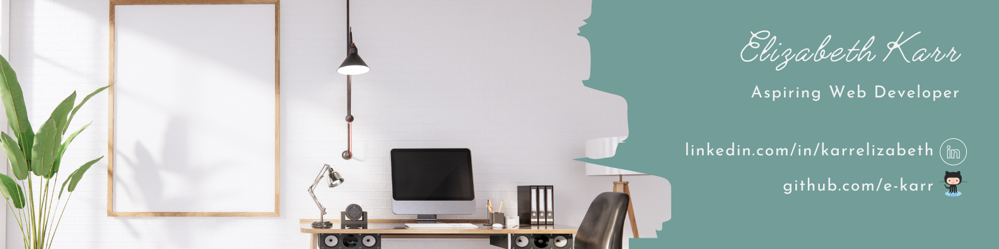

## Hello!

I'm Elizabeth (she/her/hers) and I'm currently learning to code so I can make a career transition to web development. Here is a bit about me and my career transition journey.

### About Me
- :dog2: I have two dogs
- :running_woman: I enjoy long-distance running
- :trophy: I play on three kickball teams, all of which have won various championships
- :airplane: I love to travel and experience new cultures
  - :shark: Fun fact: I've been cage diving with sharks in South Africa!

#### Now Playing:

### Bootcamps and Online Resources
- Finished CS50x December 2022
- Currently learning with The Odin Project and LaunchCode

### Languages & Frameworks
I have been learing a varity of languages and frameworks.
- HTML
- CSS
- Javascript
- Python
- Flask
- SQL

### Personal Passion Project
As I build my skills, I have been applying what I learn to a large passion project. I have an idea to reimagine the website and event registration capability for my local kickball league. Additionally, I want to build an app the league can use to keep track of the score and statistics during a kickball game. Ultimately, I'd like the app to be a one-stop-shop for all information regarding the kickball league and the current season. Here is what I've built so far:
- [Registration web application](https://github.com/e-karr/cs50-final-project.git)

- IN PROGRESS

